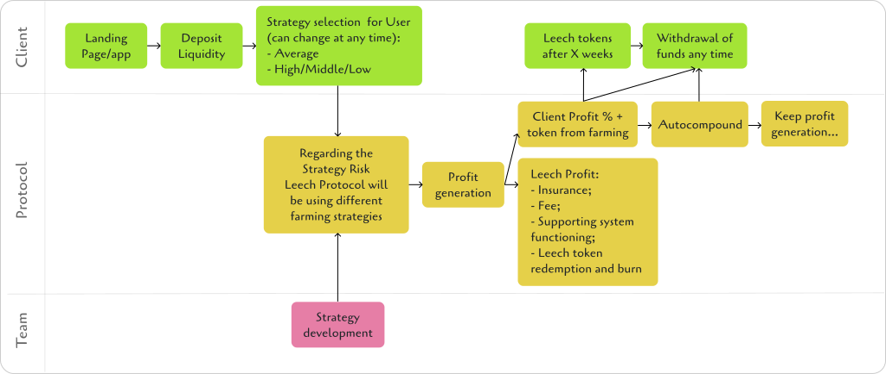
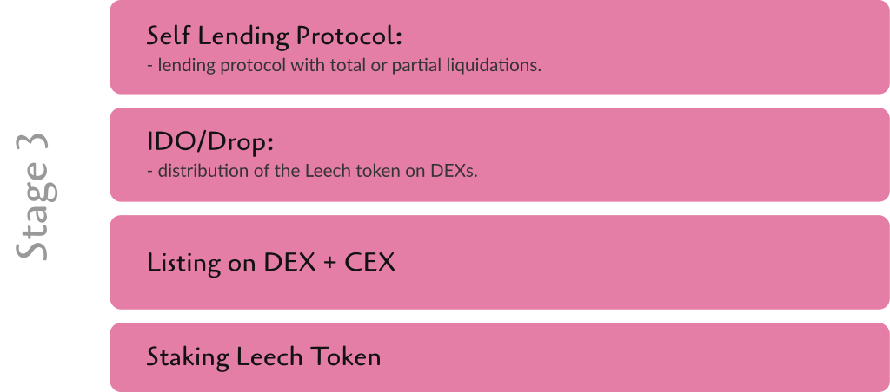

#### The crypto world is actively developing.

More and more people are showing an interest in decentralized finance - just look at the number of new startups, ecosystems and conferences.
Countries are even beginning to implement cryptocurrencies as legal tender.

This new technology is unknown, engaging, and promising, but the most important reason for its rise in popularity is people looking for alternative ways to earn money (preferably remotely, with minimum effort), and store value.

Using DeFi is currently very complicated for inexperienced users due to the lack of a refined User Experience. Users need to understand how multiple blockchains work, which tokens are on which chains, where and how their yields are generated, etc.
As time goes on, this issue is being remedied. Bridges have become popular for moving assets across different chains, and in the future, users won’t know or care what blockchain they are using. It's time for cross-chain: a technology that the crypto market has been missing, until now.
Leech Protocol is one of the first automatic DeFi cross-chain yield aggregators to earn optimal profits on different blockchains.

### The Problem

Users who utilize yield farming services look for dapps on different blockchains that provide the highest returns.  
As a rule, such users have a complex farming system built: they look for pools on other blockchains, build the most optimal strategies  
algorithmically, constantly monitor the state of the crypto market, and transfer their liquidity when they discover a better location.

Inexperienced users are generally afraid of the words such as blockchain, DeFi, and token.  
These users need a simple and affordable solution that will introduce them to decentralized finance.

Farming was originally conceived as a passive income, however, with the advent of a large number of blockchains, platforms and various strategies, all this has become routine work. User is actively involved in tracking trends on different blockchains, determines the strategies, and calculates the risks. All this takes time - the most valuable resource in the world. We want to make DeFi easy again.

### Value Proposition

Leech Protocol allows users to easily farm on multiple chains. They deposit their liquidity into Leech Protocol, which then performs operations that the user would normally do manually. Leech has incorporated protocols like Curve, PancakeSwap, Uniswap, etc. with specific liquidity pairs that are monitored.

If a user deposits, for example, some USDT into Leech Protocol, he deposits it in one place, and doesn’t need to worry about anything else. He doesn’t have to choose which blockchains to farm on or look for good yield, our protocol does it all for him. By aggregating multiple blockchains, it finds the best place to put his liquidity to generate optimal profitability. If the yield falls by X%, his liquidity is moved to another location that is more suitable. This is just one example of Leech’s functionality, and more complex strategies with various risk levels and returns will be added in the future.

A natural question arises - how is our product different from existing aggregators?

Today, cross-chain farming is a poorly developed area. Few entrepreneurs are looking in this direction and we aim to be the premiere service in this market.

Currently, existing aggregators still have a number of limitations:

1. The User must provide liquidity on the desired blockchain, and this is a big issue, as he then has to know which blockchain is best for his desires, and how to navigate many different chains.  
2. There are offers from 50+ pools, and a User chooses which one to use.

No system will choose the most favorable conditions for the User. Now, the user needs to log in every day, check the status of his liquidity, and calculate his returns manually. The APY shown is often different from the actual returns that the User receives. Users can spend 3-5 days reviewing their strategy. Ultimately, it becomes daily routine work.

Leech Protocol allows our users to permanently participate in the process of creating optimal profitability. How does it work?

Below are more details on the strategies themselves.
What ensures profitability?
A feature of our product is automatic complex multi-part strategies that our team develops and updates. Strategies are built based on exploring the capabilities of each blockchain and creating a plan for safe earnings.

Furthermore, Leech Protocol is automatically engaged in choosing the best strategy for each User.

Buy Cake Tokens and go short with double leverage for 33% of the total and deposit the remaining 67% in an auto compounding farm on Pancake Swap with about 80% APR.
We get less income due to the 2x short (≈50% instead of 80%). But it's still better because it's safer. Instead of Cake, we could use any high volatility coin that can be hedged.

### Lending and farming

Another feature of Leech Protocol is a hybrid of lending and farming, which allows the User to get good returns with highly liquid assets.
For example, the User deposits 1 Bitcoin into our platform, which serves as collateral, while the lent coins are also used in different protocols for farming. This allows the user to receive not just their classic return of 3-5% on their Bitcoin, but about 15-30% more.

**Partial liquidation**

Partial liquidations don't happen frequently.
In the classic lending protocol, when the liquidation threshold is reached, the User’s assets could all be sold at an unfavorable rate with possible penalties.
However, Leech Protocol allows the user to sell part of the assets necessary to cover the drawdown of the exchange rate difference, while the rest of the assets remain with the User. This enables our User to end up in a better condition.

### Security
We did a complete analysis of DeFi protocol hacks. We have classified all known hacks and worked out possible methods of protection against them.
Security audits are a constant mechanism of Leech protocol. We will provide audits with the implementation of each feature that affects the work of smart contracts.
Notification protocols have been developed to prevent transactions with suspicious activity.
We plan to involve white hackers to test the security system of our product, as well as the use of Bug Bounties.
Creation of the protocol’s own asset insurance fund and involvement of external insurance organizations is planned.

### Market

Currently, the decentralized finance sector represents only a tiny percentage of its maximum potential, and significant growth is inevitable.  
During its existence of a little more than three years, DeFi has shown multiple capitalization increases from year to year.

### Roadmap

